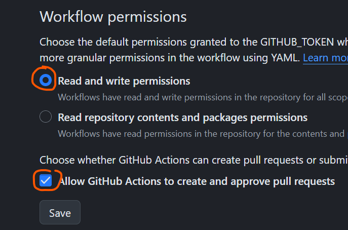

# Kicad project template
[](https://github.com/sirlilpanda/kicad-project-template/actions/workflows/main.yaml)

This is a simple project template for new kicad projects. This template has some basic setup already completed such as workflows for auto creating all the things you forget when creating a kicad project such as:

- gerbers
- bom
- schematic pdf

This workflow will also run the design rules check as well on the PCB and schematic to ensure that you upload a working PCB. This template has a simple schematic PCB in it (because DRC fails on an empty PCB). Shown below is the example PCB.


besides from that the project also has:

- common predefined trace widths
- smallest vias size [JLCPBC allows](https://jlcpcb.com/capabilities/Capabilities#Drilling)
- custom net colours in the schematic editor
    - `red` for +V
    - `blue` for -V
    - `grey` for ground

to create a repo from this template follow this [guide](https://docs.github.com/en/repositories/creating-and-managing-repositories/creating-a-repository-from-a-template)

contained in this template are:
---
- `.github/` : all files relating to github actions and other admin see [here](https://docs.github.com/en/communities/setting-up-your-project-for-healthy-contributions) for more example of what can be placed in it
    - `workflows/` : this is where the github actions are kept
        - `main.yaml` : the main github action that will auto generate all files required and run DRC and ERC

- `Hardware/` : this is where the kicad project lives
    - `template/` : this is where the kicad project actually is
    - `template_PCB/` : this is where the auto generated gerbers for the kicad project are stored

- `Hardware_Docs/` : as the name says this is where documentation on the design lives
    - `BOM/`     : where the bill of materials and price breakdown are kept<sup> 1 </sup>
        - `bom.csv`: the auto generated bom for the kicad project
    - `sch.pdf` : the schematic for the kicad project, auto generated by the github action

- `res/` : where resources are stored for the README

- `.gitignore`: a slightly modified gitignore from the [standard one](https://github.com/github/gitignore/blob/main/KiCad.gitignore)

- `README.md` : this file, suggest you change this one creating your project

- `tools.py` : a simple script for project configuration and a thin wrapper around [kicads cli tool](https://docs.kicad.org/8.0/en/cli/cli.html), usage can be see [here](#setup-script-and-tool-usage)

## setup script and tool usage
`tools.py` allow for basic functionally to be used within the project such as creating BOMs, schematics, and grbrs without needing to push your local changes. This script is a simple wrapper around [kicads cli tool](https://docs.kicad.org/8.0/en/cli/cli.html) written in python for better cross platform support. For these command the arguments follow this syntax
```
{command} {descriptive_argument_name = default_value_if_none_provided}
```

### setting the kicad-cli alias
as people may have the kicad cli install in different location you can set the path of this command, using the following
```sh
python tools.py change_path {new_path}
```

### changing the name of the project
since few people will want to call their projects `template` you can change this with the command
```sh
python tools.py rename {new_name}
```
### creating gerbers
you can create the gerbers for the project using:
```sh
python tools.py pcb {output = Hardware_{project_name}_PCB/}
```

### creating bom
encase you want to further script the BOM creation you can generate it using:
```sh
python tools.py bom {output = Hardware_Docs/BOM/}
```

### creating PDF
if you close kicad and forgot to plot your pdf you can run:
```
python tools.py pdf {output = Hardware_Docs}
```

## common problems

some common problem may occur when setting up the issues fixes to them are listed below:

### permission denied
if you get an error that looks something long these lines:

where the action can not commit the changes due to not having permissions follow these steps:
1. open the repo setting

2. then head in to actions : General

3. then scroll down to workflow permissions and ensure that both
    `Read and write permissions` and `Allow GitHub Actions to create and approve pull requests` are ticked as seen below


this should fix the problem if not, go harass stack overflow they need it


## improvements

ill think of something soon

### footnotes
1. this will be expanded on in the future with possible digikey integration

